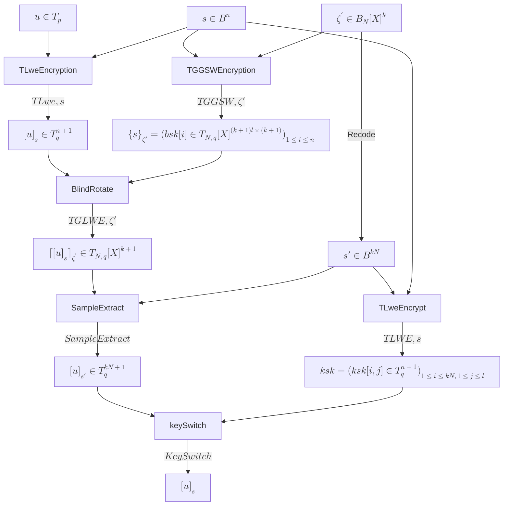

# Tensor based Fully Homomorphic Encryption

## Bootstrapping

```mermaid
graph TB
    %%Alice plainText TLweKey TGGSWKey%%
    plainText["$$u \in \mathbb{T}_p$$"]
    TLweKey["$$s\in \mathbb{B}^n$$"]
    TGGSWKey["$$\zeta^\prime \in \mathbb{B}_N[X]^k $$"]

    %%TLweCiphertext of plainText and TLweKey%%
    TLweCiphertext["$$[u]_s \in \mathbb{T}_q^{n+1}$$"]
    %%TGGSWCiphertext of TLweKey and TGGSWKey%%
    %%TGGSWCiphertext["$$\{s\}_{\zeta\prime} = (bsk[1], \cdots, bsk[n]),  bsk[j] \in \mathbb{T}_{N,q}[X]^{(k+1)l \times (k+1)}$$"]%%
    TGGSWCiphertext["$$\{s\}_{\zeta\prime} = (bsk[i] \in \mathbb{T}_{N,q}[X]^{(k+1)l \times (k+1)})_{1\le i \le n}$$"]
    %%TGLweCiphertext of TLweCiphertext and TGGSWKey%%
    TGLweCiphertext["$$\lceil [u]_s \rceil_{\zeta^\prime} \in \mathbb{T}_{N,q}[X]^{k+1}$$"]
    %%recode of TGGSWKey%%
    recode["$$s\prime \in \mathbb{B}^{kN}$$"]
    %%sampleExtract of TGLweCiphertext%%
    sampleExtract["$$[u]_{s\prime}\in \mathbb{T}_q^{kN+1}$$"]
    %%ksk is TLWE cipher with key TLweKey%%
    ksk["$$ksk = (ksk[i,j] \in \mathbb{T}_q^{n+1})_{1\le i\le kN, 1\le j \le l}$$ "]
    %%keyswitch return TLweCiphertext%%
    %%keyswitch["$$[u]_s \in \mathbb{T}_q^{n+1}$$"]%%

    %%Bootstrapping%%
    plainText & TLweKey --> TLweEncryption -->|"$$TLwe,s$$"| TLweCiphertext
    TLweKey & TGGSWKey --> TGGSWEncryption -->|"$$TGGSW,\zeta\prime$$"| TGGSWCiphertext
    TLweCiphertext & TGGSWCiphertext --> BlindRotate -->|"$$TGLWE,\zeta\prime$$"| TGLweCiphertext
    TGGSWKey -->|"Recode"| recode
    TGLweCiphertext & recode --> SampleExtract -->|"$$SampleExtract$$"| sampleExtract
    recode & TLweKey --> TLweEncrypt -->|"$$TLWE,s$$"| ksk
    sampleExtract & ksk --> keySwitch -->|"$$KeySwitch$$"| noise["$$[u]_s$$"]

```
