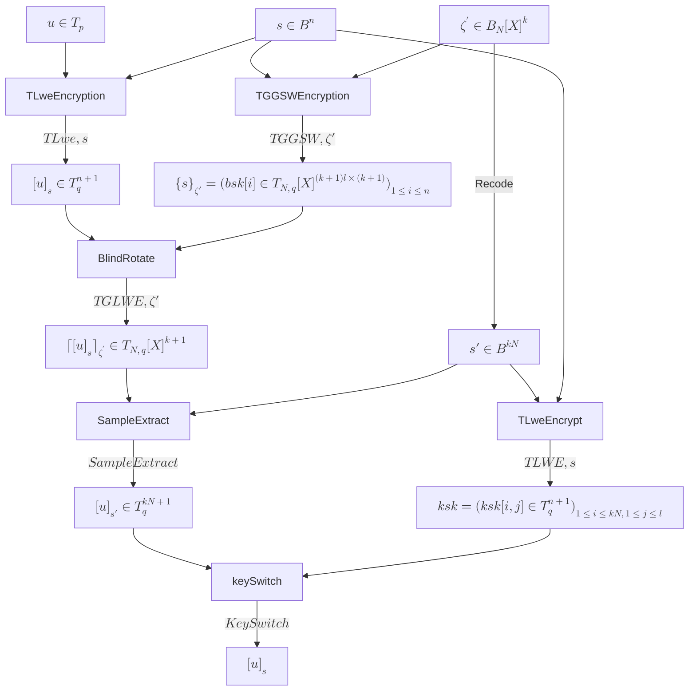
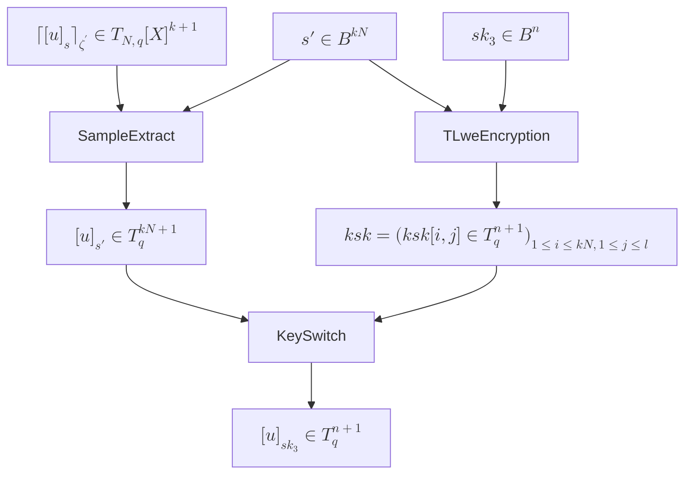

# Tensor based Fully Homomorphic Encryption

## Bootstrapping

## 更换密钥

假设Alice（$u, sk_1, sk_2$）现在想要更换密钥$sk_1$为$sk_3$，（从理论上来说，Alice不需要知道$sk_2$，因为$sk_2$只在`Bootstrapping`过程中使用，而且我们并不需要主动解密），是否可以在不丢失密文不暴露密钥的情况下完成密钥更换？

观察`Bootstrapping`过程，可以发现，在执行`SampleExtract`之后，Alice得到了新的在密钥$s\prime$下的密文$[u]_{s\prime}$。$s\prime$可以认为相当于Alice的新密钥，因此，她可以用$s\prime$来解密$[u]_{s\prime}$。但是这个密钥不是随机选择的，它与$sk_2$有关。不过这里说明$[u]_{s\prime}$已经与$sk_1$无关。

因此，接下来的`KeySwitch`过程，Alice可以用$sk_3$来加密$s\prime$得到新的`ksk`，然后经过`KeySwitch`操作之后得到新的在$sk_3$下的密文。这样，Alice就完成了密钥更换：

### 遗留

- `Bootstrapping`是一个非常消耗资源的过程，只是为了更换密码就启动`Bootstrapping`过程是非常不划算的。
- $sk_1, sk_2 \in \mathbb{B}^n$，不能直接使用`TLWE， TGLWE`加密。`TLWE， TGLWE`方法的原文空间是`torus`，其中 $0\sim 1$。
