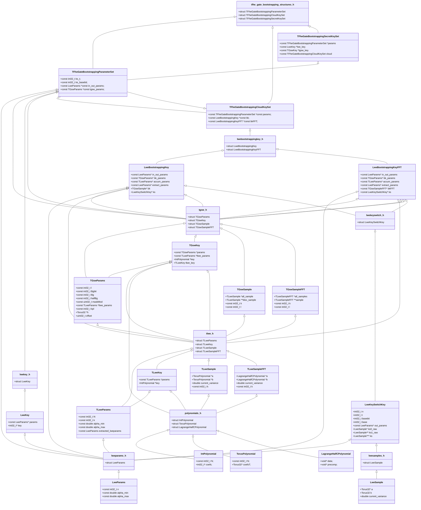

# tensor based fully homomorphic encryption

```mermaid
classDiagram
    %% lwesamples.h
    class lwesamples_h{
        +struct LweSample
    }
    class LweSample{
        +Torus32* a
        +Torus32 b
        +double current_variance
    }
    lwesamples_h <|-- LweSample
    %% lwesamples.h

    %% tlwe.h
    class tlwe_h{
        +struct TLweParams
        +struct TLweKey
        +struct TLweSample
        +struct TLweSampleFFT
    }
    tlwe_h <|-- TLweParams
    tlwe_h <|-- TLweKey
    tlwe_h <|-- TLweSample
    tlwe_h <|-- TLweSampleFFT
    class TLweParams{
        +const int32_t N
        +const int32_t k
        +const double alpha_min
        +const double alpha_max
        +const LweParams extracted_lweparams
    }
    TLweParams <|-- lweparams_h
    class TLweKey{
        +const TLweParams *params
        +IntPolynomial *key
    }
    TLweKey <|-- TLweParams
    TLweKey <|-- polynomials_h
    class TLweSample{
        +TorusPolynomial *a
        +TorusPolynomial *b
        +double current_variance
        +const int32_t k
    }
    TLweSample <|-- polynomials_h
    class TLweSampleFFT{
        +LagrangeHalfCPolynomial *a
        +LagrangeHalfCPolynomial *b
        +double current_variance
        +const int32_t k
    }
    TLweSampleFFT <|-- polynomials_h
    %% tlwe.h

    %% lweparams.h
    class lweparams_h{
        +struct LweParams
    }
    lweparams_h <|-- LweParams
    class LweParams{
        +const int32_t n
        +const double alpha_min
        +const double alpha_max
    }
    %% lweparams.h

    %% tgsw.h
    class tgsw_h{
        +struct TGswParams
        +struct TGswKey
        +struct TGswSample
        +struct TGswSampleFFT
    }
    tgsw_h <|-- TGswParams
    tgsw_h <|-- TGswKey
    tgsw_h <|-- TGswSample
    tgsw_h <|-- TGswSampleFFT
    class TGswParams{
        +const int32_t l
        +const int32_t Bgbit
        +const int32_t Bg
        +const int32_t halfBg
        +const uint32_t maskMod
        +const TLweParams *tlwe_params
        +const int32_t kpl
        +Torus32 *h
        +uint32_t offset
    }
    TGswParams <|-- tlwe_h
    class TGswKey{
        +const TGswParams *params
        +const TLweParams *tlwe_params
        +IntPolynomial *key
        +TLweKey tlwe_key
    }
    TGswKey <|-- TGswParams
    TGswKey <|-- tlwe_h
    TGswKey <|-- polynomials_h
    TGswKey <|-- tlwe_h
    class TGswSample{
        +TLweSample *all_sample
        +TLweSample **bloc_sample
        +const int32_t k
        +const int32_t l
    }
    TGswSample <|-- tlwe_h
    class TGswSampleFFT{
        +TLweSampleFFT *all_samples
        +TLweSampleFFT **sample
        +const int32_t k
        +const int32_t l
    }
    TGswSampleFFT <|-- tlwe_h
    %% tgsw.h

    %% lwekeyswitch.h
    class lwekeyswitch_h{
        +struct LweKeySwitchKey
    }
    lwekeyswitch_h <|-- LweKeySwitchKey
    class LweKeySwitchKey{
        +int32_t n
        +int32_t t
        +int32_t basebit
        +int32_t base
        +const LweParams* out_params
        +LweSample* ks0_raw
        +LweSample** ks1_raw
        +LweSample*** ks
    }
    LweKeySwitchKey <|-- lweparams_h
    LweKeySwitchKey <|-- lwesamples_h
    %% lwekeyswitch.h

    %% lwebootstrappingkey.h
    class lwebootstrappingkey_h{
        +struct LweBootstrappingKey
        +struct LweBootstrappingKeyFFT
    }
    lwebootstrappingkey_h <|-- LweBootstrappingKey
    lwebootstrappingkey_h <|-- LweBootstrappingKeyFFT
    class LweBootstrappingKey{
        +const LweParams* in_out_params
        +const TGswParams* bk_params
        +const TLweParams* accum_params
        +const LweParams* extract_params
        +TGswSample* bk
        +LweKeySwitchKey* ks
    }
    LweBootstrappingKey <|-- lweparams_h
    LweBootstrappingKey <|-- tgsw_h
    LweBootstrappingKey <|-- tlwe_h
    LweBootstrappingKey <|-- tgsw_h
    LweBootstrappingKey <|-- lwekeyswitch_h
    class LweBootstrappingKeyFFT{
        +const LweParams* in_out_params
        +const TGswParams* bk_params
        +const TLweParams* accum_params
        +const LweParams* extract_params
        +const TGswSampleFFT* bkFFT
        +const LweKeySwitchKey* ks
    }
    LweBootstrappingKeyFFT <|-- lweparams_h
    LweBootstrappingKeyFFT <|-- tgsw_h
    LweBootstrappingKeyFFT <|-- tlwe_h
    LweBootstrappingKeyFFT <|-- tgsw_h
    LweBootstrappingKeyFFT <|-- tgsw_h
    LweBootstrappingKeyFFT <|-- lwekeyswitch_h
    %% lwebootstrappingkey.h

    %% tfhe_gate_bootstrapping_structures.h
    class tfhe_gate_bootstrapping_structures_h{
        +struct TFheGateBootstrappingParameterSet
        +struct TFheGateBootstrappingCloudKeySet
        +struct TFheGateBootstrappingSecretKeySet
    }
    tfhe_gate_bootstrapping_structures_h <|-- TFheGateBootstrappingParameterSet
    tfhe_gate_bootstrapping_structures_h <|-- TFheGateBootstrappingCloudKeySet
    tfhe_gate_bootstrapping_structures_h <|-- TFheGateBootstrappingSecretKeySet
    class TFheGateBootstrappingParameterSet{
        +const int32_t ks_t;
        +const int32_t ks_basebit;
        +const LweParams *const in_out_params;
        +const TGswParams *const tgsw_params;
    }
    TFheGateBootstrappingParameterSet <|-- lweparams_h
    TFheGateBootstrappingParameterSet <|-- tgsw_h
    class TFheGateBootstrappingCloudKeySet{
        +const TFheGateBootstrappingParameterSet *const params;
        +const LweBootstrappingKey *const bk;
        +const LweBootstrappingKeyFFT *const bkFFT;
    }
    TFheGateBootstrappingCloudKeySet <|-- TFheGateBootstrappingParameterSet
    TFheGateBootstrappingCloudKeySet <|-- lwebootstrappingkey_h
    class TFheGateBootstrappingSecretKeySet{
        +const TFheGateBootstrappingParameterSet *params
        +const LweKey *lwe_key
        +const TGswKey *tgsw_key
        +const TFheGateBootstrappingCloudKeySet cloud
    }
    TFheGateBootstrappingSecretKeySet <|-- TFheGateBootstrappingParameterSet
    TFheGateBootstrappingParameterSet <|-- lwekey_h
    TFheGateBootstrappingParameterSet <|-- tgsw_h
    TFheGateBootstrappingParameterSet <|-- TFheGateBootstrappingCloudKeySet
    %% tfhe_gate_bootstrapping_structures.h

    %% lwekey.h
    class lwekey_h{
        +struct LweKey
    }
    lwekey_h <|-- LweKey
    class LweKey{
        +const LweParams* params
        +int32_t* key
    }
    LweKey <|-- lweparams_h
    %% lwekey.h

    %% polynomials.h
    class polynomials_h{
        +struct IntPolynomial
        +struct TorusPolynomial
        +struct LagrangeHalfCPolynomial
    }
    polynomials_h <|-- IntPolynomial
    polynomials_h <|-- TorusPolynomial
    polynomials_h <|-- LagrangeHalfCPolynomial
    class IntPolynomial{
        +const int32_t N;
        +int32_t* coefs;
    }
    class TorusPolynomial{
        +const int32_t N;
        +Torus32* coefsT;
    }
    class LagrangeHalfCPolynomial{
        +void* data;
        +void* precomp;
    }
    %% polynomials.h

```
