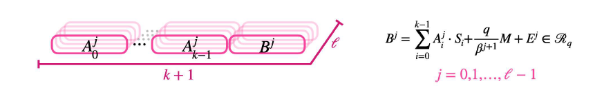
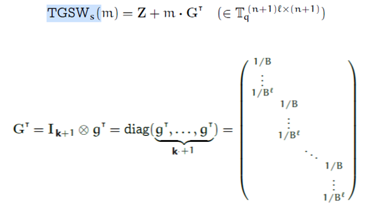
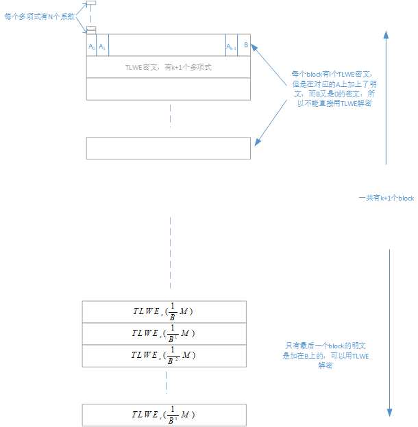
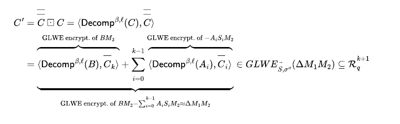
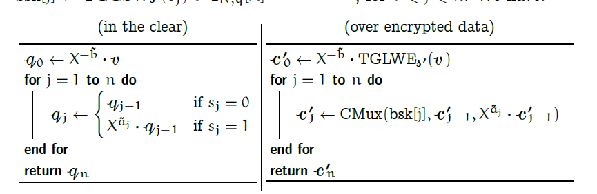
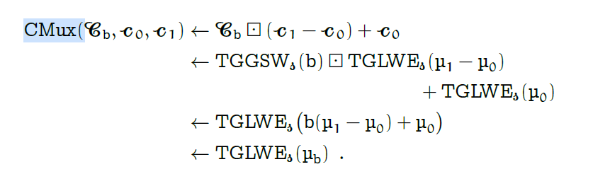
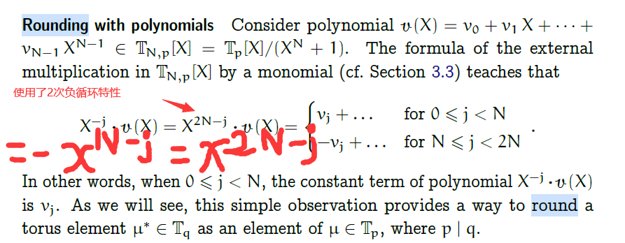

# 代码常用符号  
- n    
   LWE 密钥的bit数

- k  
  T(G)Lwe 加密中 密钥中多项式的个数，等价于LWE加密中的n

- N  
   T(G)Lwe加密中多项式的度，要求是2的幂

- l  
   分解的层数

- Bgbit   
   分解基的位数，log_2(Bg)  

- key   
   LWE key， key s

- key_bk    
   bootsrap key, 是 TGswKey 类型， key s'

- bk
   LweBootstrappingKey 类型。 里面有两个key

- t   
    key switch key里分解的层数, 和GSWkey的l没有关系

- basebit
    key switch key里分解基的位数，log_2(base),和GSWkey的Bgbit没有关系

```
struct LweBootstrappingKey{
    ...
    TGswSample* bk; ///< the bootstrapping key (s->s")
    LweKeySwitchKey* ks; ///< the keyswitch key (s'->s)
    ...
};
```
    bk 是bootstrap key，是用 s‘对s进行GSW加密以后得到的密文；     
    ks 是keyswitch key。

# LWE

## LweKey
```
struct LweKey {
   ...
   int32_t* key;
   ...
};
```
key int32_t[n] 的数组，每个元素保存的是0或者1。

## lweSymDecrypt
```
EXPORT Torus32 lweSymDecrypt(const LweSample* sample, const LweKey* key, const int32_t Msize)
```
解密函数，这里要说明Msize的用法。首先执行phi = lwePhase(sample, key);得到一个包含噪声的Torus32 phi，时候要去掉噪声以后才能得到明文。Msize就是明文的消息空间。在实际使用的时候，明文的消息空间是M，传递给lweSymEncrypt进行加密的message一定是某个明文通过modSwitchToTorus32（a,M）以后得到的Torus32，因此在lweSymDecrypt中，调用lwePhase以后要把phi再转回到明文的消息空间M。从这个意义上来说，明文的消息空间不能是 $2^{32}$ ，直接调用lweSymEncrypt时错误的，要先调用modSwitchToTorus32把明文切换到Torus32，然后才调用lweSymEncrypt,返回Torus32。但是这个Torus32已经被约束到明文空间M转换得到Torus32的上。可以通过t32tod（）* M来得到M空间上的明文，也可以直接通过移位来得到M空间上的明文（如果M是2的幂）。
```
    TEST_F (LweTest, lweSymEncryptDecrypt) {
        //TODO: parallelization
        static const int32_t NB_SAMPLES = 10;
        static const int32_t M = 8; // 消息空间8，范围[-4，4)
        static const double alpha = 1. / (10. * M);

        //随便拿一个key
        const LweKey *key =  all_keys[0];
        const LweParams *params = key->params;
        LweSample *sample = new_LweSample(params);

        int32_t messageInM = 2;
        // 1 把明文转换为 Torus32
        Torus32 message = modSwitchToTorus32(messageInM, M);
        // 2 对Toruse32 上的message进行加密
        lweSymEncrypt(sample, message, alpha, key);

        // 3 解密，得到在Torus32上的密文，值已经被约束到 n/M 上
        Torus32 decrypt = lweSymDecrypt(sample, key, M);

        // 4 得到浮点数明文值,应该和 messageInM/M相同
        double ddecrypt = t32tod(decrypt);
        ASSERT_LE(absfrac(ddecrypt - messageInM/((double)M)), 10. * alpha);

        {
            // 5 modSwitchFromTorus32 得到M空间上的明文
            int32_t idecrypt = modSwitchFromTorus32(decrypt,M);
            ASSERT_EQ(idecrypt, messageInM);
        }
        {
            // 5 移位得到M空间上的明文
            int32_t idecrypt = decrypt >> (32-3);
            ASSERT_EQ(idecrypt, messageInM);

        }

        delete_LweSample(sample);

    }

```

# TLwe
## TLweSample 
TLweSample  是多项式密文，k是mask多项式的个数，N是多项式的度。   
```
struct TLweSample {
    TorusPolynomial *a; ///< array of length k+1: mask + right term
    TorusPolynomial *b; ///< alias of a[k] to get the right term
    double current_variance; ///< avg variance of the sample
    const int32_t k;
    ...
};
```
TLweSample 提供了两个指针，在分配内存的时候， a 分配的大小是 k+1 个多项式，其中最后一个就是留给b使用的，所以b的地址是 a+k

## TLweKey   
```
struct TLweKey {
    ...
    IntPolynomial *key; ///< the key (i.e k binary polynomials)
    ...
};
```
key 是一个指向 IntPolynomial[k] 的指针，数组中每个IntPolynomial元素是一个int32_t[N]的数组，用来保存多项式系数。

# TGlev  



# TGsw
TGSW密文的定义

## TGSWSample的内存格式
TGSWSample保存了(k+1)xl行sample，每行sample的形式都是一个TLWE密文。

## TGswKey   
```
struct TGswKey {
    ...
    IntPolynomial *key; ///< the key (array of k polynomials)
    TLweKey tlwe_key;
    ...
};
```
实际保存了一个TLweKey， key指向 tlwe_key->key

## tGswSymEncryptInt  把整数加密成 TGsw密文
```
EXPORT void tGswSymEncryptInt(TGswSample *result, const int32_t message, double alpha, const TGswKey *key) {
    tGswEncryptZero(result, alpha, key);
    tGswAddMuIntH(result, message, key->params);
}
```
首先生成一个0的TGsw密文，然后tGswAddMuIntH得到需要的结果。

```
EXPORT void tGswAddMuIntH(TGswSample *result, const int32_t message, const TGswParams *params) {
    const int32_t k = params->tlwe_params->k;
    const int32_t l = params->l;
    const Torus32 *h = params->h;

    // compute result += H
    for (int32_t bloc = 0; bloc <= k; ++bloc)
        for (int32_t i = 0; i < l; i++)
            result->bloc_sample[bloc][i].a[bloc].coefsT[0] += message * h[i];
}
```
message看作只有常数项不为0的多项式，对常数项进行分解，然后加到每个Glev密文的常数项上去。message可以看作一个Trival的密文，可以直接加到原来的GGSW（0）的密文上去，得到一个GGSW（message）密文。
h[i] 应该是事先计算好的 :

$h[i] =\frac{q}{\beta^{j+1}}$

<font color="red">明文通过乘G矩阵以后被分配到每个block的不同列上去了</font>
## TGswParams
```
struct TGswParams {
    const int32_t l; ///< decomp length
    const int32_t Bgbit;///< log_2(Bg)
    const int32_t Bg;///< decomposition base (must be a power of 2)
    const int32_t halfBg; ///< Bg/2
    const uint32_t maskMod; ///< Bg-1
    const TLweParams *tlwe_params; ///< Params of each row
    const int32_t kpl; ///< number of rows = (k+1)*l
    Torus32 *h; ///< powers of Bgbit
    uint32_t offset; ///< offset = Bg/2 * (2^(32-Bgbit) + 2^(32-2*Bgbit) + ... + 2^(32-l*Bgbit))
    ...
};
```
## TGSW x TGLWE


 TGSW可以看作是由 k+1个 “TGLev”密文组成的。输入的TGLWE密文可以看作k+1个多项式，分别是$(A_0,A_1,A_{k-1},B)$, 对于其中的每一项进行分解，都可以得到l个多项式，把每个多项式和每个“TGLevE密文”相乘，得到新的TGLevE密文，然后把这k+1个“TGLWE密文”加起来，得到最后的结果TGLWE密文。需要(k+1) x l x l 次多项式乘法运算。

 ## CMux
 
 

# 多项式 
## 单项式 乘 多项式 以后 rounding
 
通过这个方法，对于负指数的单项式也能转换成正指数的单项式进行计算。
```
EXPORT void tfhe_blindRotateAndExtract(LweSample *result,
    ...

    if (barb != 0) torusPolynomialMulByXai(testvectbis, _2N - barb, v);
    else torusPolynomialCopy(testvectbis, v);
    ...
}
```
在上面的代码中，原来是计算$x^{-b} v$的，转换成计算 $x^{2N-b} v$

# Fake
在test里，Fack提供了简化版的测试桩。

## placement new‌
在已经分配好的地址上重新构造对象：
```
inline LweSample *fake_new_LweSample(const LweParams *params) {
    FakeLwe *reps = (FakeLwe *) malloc(sizeof(FakeLwe));
    new(reps) FakeLwe();
    return (LweSample *) reps;
}

```

## lwe
### LweSample VS FakeLwe
FakeLwe 没有 Torus32* a 数组指针，只有 message， 和 LweSample 的b相当。message是没有加密的。
替换函数：
-  fake_new_LweSample  
new_LweSample
-  fake_delete_LweSample   
delete_LweSample
- fake_new_LweSample_array  
new_LweSample_array
- fake_delete_LweSample_array    
delete_LweSample_array
- fake_lweCopy  
lweCopy
- fake_lweNegate  
lweNegate
- fake_lweSymEncrypt 直接把明文放入 message  
lweSymEncrypt    
**FAKE没有提供 lweSymDecrypt，因为 fake_lweSymEncrypt 直接返回的就是明文了，不需要要再approxPhase来去掉噪声了**
- fake_lweSymEncryptWithExternalNoise 直接把明文放入 message，没有加入noise  
lweSymEncryptWithExternalNoise
- fake_lweNoiselessTrivial   
lweNoiselessTrivial
- fake_lwePhase    计算 phi = b - a.s ，此时依然包括噪声     
lwePhase
- fake_lweSubTo  
lweSubTo
- fake_lweAddTo  
lweAddTo  
- fake_lweAddMulTo  
lweAddMulTo
- fake_lweSubMulTo  
lweSubMulTo

## bootstrap

### LweBootstrappingKey Vs FakeLweBootstrappingKey
两者在大小上没有区别。成员变量的类型也没有区别，但是在构造的时候，这些指针的都指向Fake类型。所以这些指针都没有分配实际的数据，只是把参数复制进来。

## keyswitch
### LweKeySwitchKey Vs FakeLweKeySwitchKey
FakeLweKeySwitchKey  没有指向key的指针，只有 KeySwitchKey 的参数。缺少的地方用0填充了。
KeySwitchKey 是 用 lwe key 对 boot strap key进行加密的结果。
