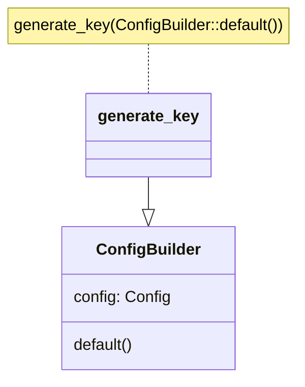

# Generic Integer Implementation Operation Mermaid

```mermaid
classDiagram
    generate_key 
    note for generate_key "generate_key(ConfigBuilder::default())"
    class ConfigBuilder{
        config: Config
        default()
    }
    generate_key --|> ConfigBuilder
```
